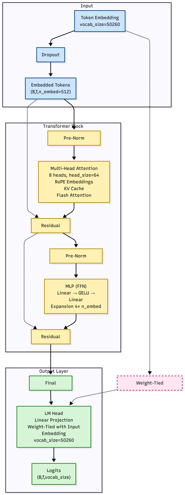
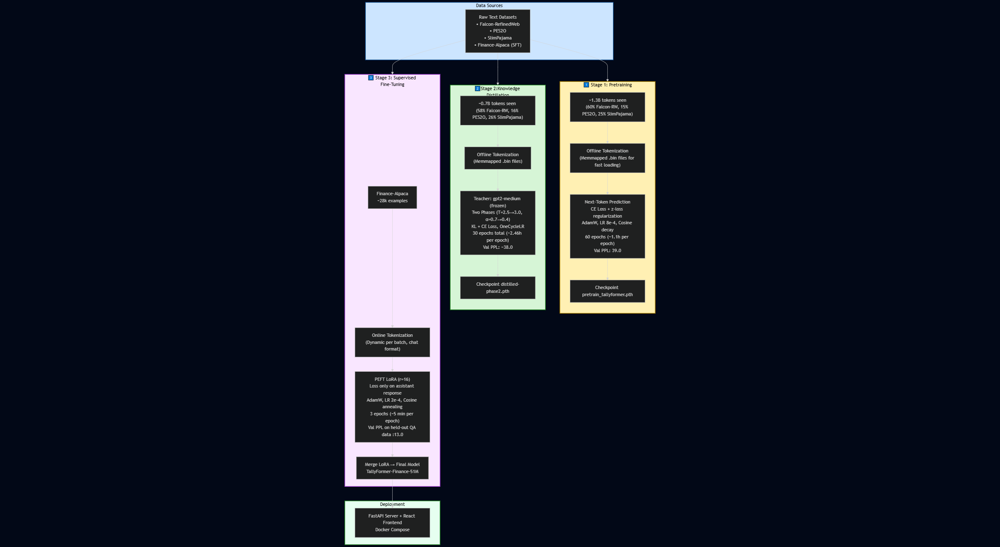
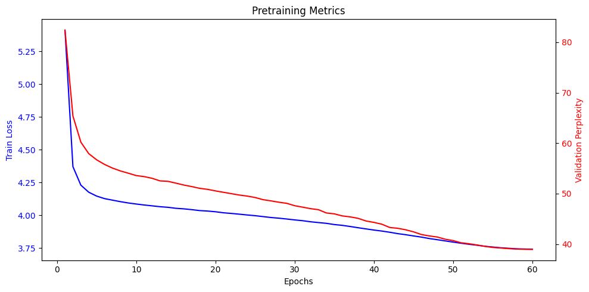
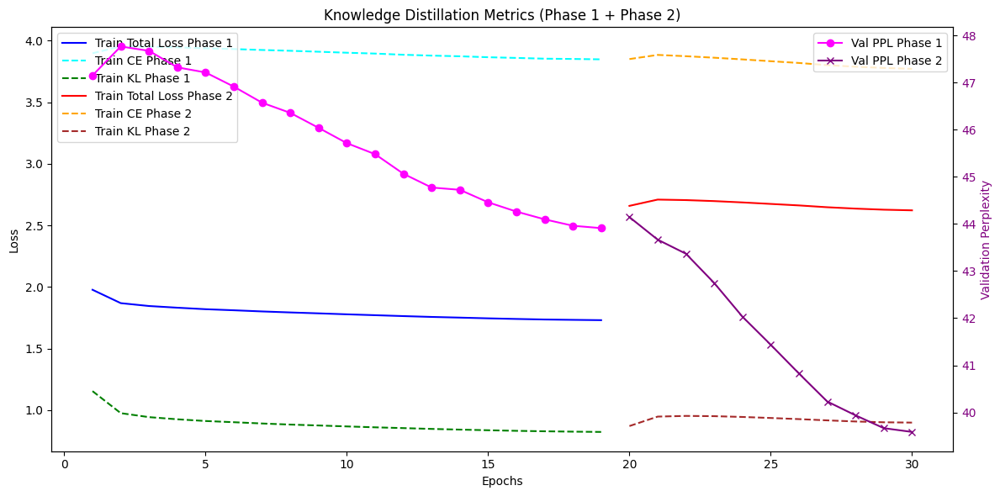

# TallyFormer-Finance-51M

**TallyFormer-Finance-51M** is a **51-million-parameter decoder-only transformer language model**, built entirely from scratch for **learning, experimentation, and research purposes**.

The project demonstrates a **fully end-to-end, scalable LLM pipeline**:  
from large-scale data preprocessing → multi-stage training → optimized inference → containerized deployment.

The architecture, training code, and deployment stack are **designed to be modular and scalable** for experimentation and research purposes.


---

## ✨ Highlights

- Built **from scratch** (no Hugging Face Trainer)
- Progressive training: **Pretraining → Distillation → SFT**
- Finance-specialized  instruction following
- Lightweight and fast inference
- Fully containerized: **FastAPI backend + React frontend**
- Clean, modular, and extensible codebase

---

## 🧠 Model Overview

- **Parameters**: ~ 51M (~197 MB in fp16 / bf16)
- **Architecture**:
  - GPT-2–style decoder-only transformer
  - Rotary Positional Embeddings (RoPE)
  - Pre-norm RMSNorm
  - GELU activations
  - Weight-tied embeddings
  - z-loss regularization
- **Context length**: 256 tokens
- **Vocabulary**: 50,260
  (GPT-2 base + `<|user|>`, `<|assistant|>`, pad token)
- **Domain**: Finance
- **Training hardware**:
  - Single RTX A6000 (48 GB VRAM)
  - 50 GB RAM, 8 vCPU
  - Pod.ai platform



---

## 📂 Repository Structure

workspace/

├── Tallyformer.ipynb # Complete training notebook (all 3 stages)

├── PreTrainResult/ # Pretraining checkpoints

├── DistillationResult/ # Distilled checkpoints

├── SFT_LoRA/ # LoRA adapter weights

├── TallyFormer-Finance-51M/ # Final merged model (HF-ready)

├──benchmark_inference_reports # Inference Benchmarking

tallyformer-system/ # Production deployment

├── tallyformer-api/ # FastAPI inference server

├── tallyformer-frontend/ # React chat UI

└── docker-compose.yml # One-command deployment


## 📊 Training Pipeline & Results



### 1️⃣ Pretraining (Continual Pretraining)
- **Tokens seen**: ~1.3B
- **Data mix**:
  - 60% Falcon-RefinedWeb
  - 15% PES2O
  - 25% SlimPajama
- **Tokenization**: Offline (memmapped binaries for maximum DataLoader speed)
- **Training**:
  - 60 epochs
  - Effective batch size: 192 (32 × gradient accumulation 6)
  - Optimizer: AdamW (LR 8e-4, cosine decay after warmup)
  - Mixed precision (bfloat16 preferred)
  - Time per epoch: ~1.1 hours
- **Result**: Validation perplexity = **39.0**



Checkpoint:
PreTrainResult/pretrain_tallyformer.pth

---

### 2️⃣ Knowledge Distillation
- **Tokens seen**: ~0.7B
- **Data mix**: 
  - 58% Falcon-RefinedWeb
  - 16% PES2O
  - 26% SlimPajam
- **Tokenization**: Offline (memmapped binaries for maximum DataLoader speed)
- **Teacher**: `gpt2-medium` (355M params)
- **Two-phase approach**: 

**Phase 1** :
- Temperature: 2.5 
- Alpha (KL weight): 0.7 
- Learning rate: 2.5e-4 
- Epochs: 19 
- Scheduler: OneCycleLR 
- Time per epoch: ~2.46 hours 

**Phase 2** :
- Temperature: 3.0 
- Alpha (KL weight): 0.4
- Learning rate: 2e-4 
- Epochs: 11 
- Scheduler: OneCycleLR 
- Time per epoch: ~2.46 hours 

**Final validation perplexity: 38.5**

Checkpoint:
DistillationResult/tallyformer-distilled-phase2.pth



---

### 3️⃣ Supervised Fine-Tuning (SFT)
- **Dataset**: Finance-Alpaca (~28k  financial instruction examples)
- **Method**: PEFT LoRA (r=16, α=32, dropout=0.05)
  - Target modules: query, key, value, proj, fc1, fc2
  - modules_to_save: lm_head
- **Formatting**: <|user|> {prompt} <|assistant|> {response}
  - Loss applied only to assistant response tokens
- **Training details**:
  - 3 epochs
  - Batch size 32 × gradient accumulation 8
  - Optimizer: AdamW (LR 2e-4)
  - Scheduler: Cosine annealing
  - Time per epoch: ~5 minutes
- **Result**: Validation perplexity on held-out QA data = **13.0**

LoRA adapter saved → merged into base distilled model → final clean checkpoint in TallyFormer-Finance-51M/

---

## 🗂️ Training Datasets

All **cleaned datasets** used in training are hosted on Hugging Face:

👉 **https://huggingface.co/datasets/haidar-ali/tallyformer-finance-dataset**

- Pretraining data
- Distillation data
- Finance-Alpaca SFT data
- Data Preprocessing Notebook
- Apache Parquet format
- Token-counted shards (GPT-2 tokenizer)

---

## 🚀 Deployment (Docker)

Requirements:
- Docker ≥ 20.x
- Docker Compose ≥ 2.0

```bash
cd tallyformer-system
docker compose up -d
```

- Frontend: http://localhost
- API docs: http://localhost:8000/docs

You can also pull the prebuilt Docker images directly from Docker Hub:
- [API](https://hub.docker.com/r/haidaryousif/tallyformer-api)
- [Frontend](https://hub.docker.com/r/haidaryousif/tallyformer-frontend)


---

## 📥 Cloning the Repository (with Git LFS)
This repository uses Git LFS for large artifacts.

Open Command Prompt / Terminal and run:
```
git lfs install
git clone https://github.com/Haidar-yousif/TallyFormer-Finance-51M.git TallyFormer
cd TallyFormer
git lfs pull
```
---

## 🧪 Model Usage Example
```
from transformers import AutoTokenizer
import torch
from workflow.model import Transformer, InferenceConfig

tokenizer = AutoTokenizer.from_pretrained("./TallyFormer-Finance-51M")
model, _, _ = Transformer.load(
    "./TallyFormer-Finance-51M/model.pth",
    device="cuda"
)

prompt = "<|user|> Explain the difference between value and growth investing. <|assistant|>"
inputs = tokenizer(prompt, return_tensors="pt").to("cuda")

with torch.inference_mode():
    output_ids, _ = model.generate(
        inputs["input_ids"],
        InferenceConfig(max_new_tokens=256, temperature=0.7, top_p=0.9)
    )

print(tokenizer.decode(output_ids[0], skip_special_tokens=False))
```
---
## 📦 Features
- High-performance custom generation: temperature, top-k, top-p, frequency/presence penalties, multi-token EOS support
- KV-cache with automatic context trimming
- Flash Attention compatible
- Mixed-precision inference
- Streaming-ready API
- Modular & extensible codebase

---

## ⚡ Inference Benchmarking

Basic inference benchmarks were conducted to evaluate **latency and throughput** across different deployment configurations.

### Metrics
- **TPS (Tokens Per Second)** – steady-state generation throughput  
- **TTFT (Time To First Token)** – initial response latency

### Benchmark Setup
- Tested on **CPU-only** and **GPU-enabled** instances
- Varying **prompt lengths** to measure scaling behavior
- Instance **utilization levels** (percentage load) explicitly controlled to simulate real-world usage

### Scenarios Evaluated
- CPU vs GPU inference performance
- TPS and TTFT as a function of Prompt length

### Results
- GPU instances show significantly lower **TTFT** and higher **TPS**, especially at longer prompt lengths
- CPU inference remains viable for low-concurrency and short-context workloads
- Throughput scales predictably with instance utilization until saturation

All benchmark outputs, logs, and summary tables are stored in: workspace/benchmark_inference_reports/

## 🎓 Purpose & Scope
This project was developed primarily for learning and research, demonstrating:

- How modern LLMs are trained from scratch
- How to scale data pipelines and training stages
- How to deploy models end-to-end with Docker

The project serves as a reference implementation for learning and research on building, training, and deploying domain-specific language models.


---
## 🤝 Contributing
Contributions are welcome!

Bug fixes

Training improvements

Evaluation scripts

Deployment enhancements

Please open an issue or submit a pull request with a clear description.

---

## 🙏 Acknowledgments
- Falcon LLM team
- SlimPajama & PES2O contributors
- Finance-Alpaca authors
- Hugging Face ecosystem
- Teacher model: GPT-2 Medium (OpenAI)
- Training platform: Pod.ai (RTX A6000)

TallyFormer-Finance-51M demonstrates a complete, transparent, and scalable approach to building domain-specific language models from scratch.

## 🔗 Connect

[Haidar Ali YOUSEF on LinkedIn](https://www.linkedin.com/in/haidar-ali-yousef-815018231/)